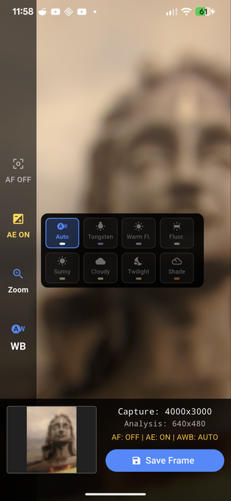

# CameraX Demo (Flutter)

Flutter app backed by a native CameraX layer that exposes low-level camera controls with high performance.



## Highlights

- Native CameraX integration for speed and low-level access.
- White balance presets via Camera2/CameraX interop.
- Manual focus distance: query current value and set a target diopter.
- Exposure controls: toggle AE and adjust exposure compensation range from the device.
- Zoom controls with device min/max ratios.
- Flutter bindings to native CameraX showing how to wire MethodChannel/EventChannel.
- Access to all three CameraX streams: Preview, ImageAnalysis, and ImageCapture.
- Configurable ImageCapture mode (latency vs quality) for faster grabs when needed.

## Run

```bash
flutter pub get
flutter run
```
